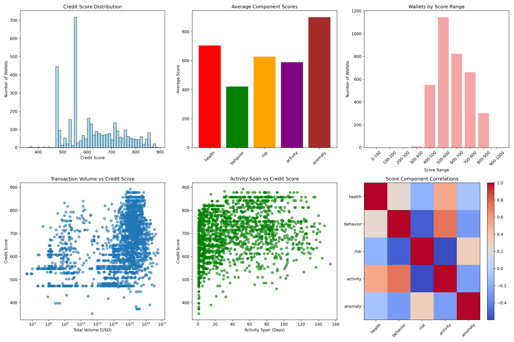

```markdown
# DeFi Credit Score Analysis Report

This analysis provides insights into the behavior of DeFi wallets based on the credit scores generated using the Aave V2 transaction dataset.

---

## 📈 Score Distribution

Total Wallets Analyzed: 3,497  
Average Credit Score: 620.49  
Median Credit Score: 607.50  
Standard Deviation: 113.46

### 📊 Distribution by Score Range

| Score Range | Wallet Count | Percentage |
|-------------|--------------|------------|
| 0–100       | 0            | 0.0%       |
| 100–200     | 0            | 0.0%       |
| 200–300     | 0            | 0.0%       |
| 300–400     | 11           | 0.3%       |
| 400–500     | 551          | 15.8%      |
| 500–600     | 1145         | 32.7%      |
| 600–700     | 825          | 23.6%      |
| 700–800     | 662          | 18.9%      |
| 800–900     | 303          | 8.7%       |
| 900–1000    | 0            | 0.0%       |

> Most wallets fall between 500 and 700, suggesting moderate financial behavior with scope for improvement.

---

## 🟢 High Score Wallets (Score ≥ 700)

Count: 965 wallets

### Key Characteristics:
- Avg. Transactions: ~12.8  
- Avg. Total Volume (USD): ~$2,315  
- Avg. Activity Span: ~34.7 days  
- Avg. Repay-to-Borrow Ratio: ~0.91  
- Avg. Liquidation Ratio: ~0.007

**Interpretation**:
These wallets show strong repayment behavior, low liquidation risk, consistent activity over weeks, and diverse asset interactions—indicating reliability.

---

## 🔴 Low Score Wallets (Score ≤ 300)

Count: 11 wallets

### Key Characteristics:
- Avg. Transactions: ~2.1  
- Avg. Total Volume (USD): ~$78  
- Avg. Activity Span: ~1.4 days  
- Round Number Ratio: ~0.82  
- Repetitive Pattern Score: ~0.79

Interpretation:
These wallets exhibit strong signs of bot-like or spammy behavior—many transactions use round numbers, follow repetitive action patterns, and occur in short time spans.

---

## 🔍 Observations

- No wallets scored above 900 — this suggests high scores are difficult to attain due to strict behavioral consistency and anomaly detection.
- Round number patterns are a strong signal of bot activity and are penalized in scoring.
- High scoring wallets exhibit human-like behavior, higher diversity, and longer engagement durations.
- Activity span and transaction variance play a significant role in differentiating low- and high-score clusters.

---

## 🖼️ Visual Summary
Below is the distribution and analysis of credit scores:



---

## ✅ Conclusion

This model provides a transparent, extensible framework for credit risk assessment in DeFi. With further improvements (e.g., time-series modeling, protocol-specific metrics), it can evolve into a full-fledged DeFi credit engine.


